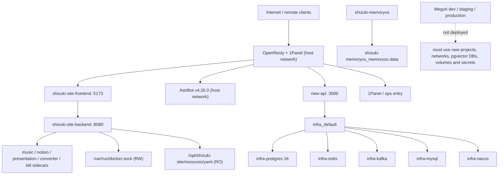

# Meguri 环境与部署基线报告

> 盘点时间：2026-07-14 21:13:22 +08:00
> 盘点范围：`D:\program\meguri-pet` 与 `111.228.35.186`（逻辑节点名 `shizuki-site`）
> 盘点方式：本地 Git/文件系统只读检查、Notion 权威文档交叉阅读、远端 Docker TLS API 只读查询、从当前工作站发起的 TCP/HTTP(S) 可达性检查
> 安全声明：本轮未读取或输出密钥值，未重启、创建、删除或修改任何远端容器、网络、卷、镜像、文件、端口、反向代理、证书、防火墙或数据库。

## 1. 执行摘要

当前仓库仍处于第一阶段框架基线，尚无 Compose、Dockerfile、Alembic、环境隔离、Release Manifest、备份恢复或 CI/CD 实现。Notion 记录的代码基线为 `feat/framework-bootstrap / 0240ea4`，实际仓库已前进到 `feat/framework-bootstrap / ad8d405`，且远端分支与本地 HEAD 一致；新增的两个提交主要属于 TTS 工作，不应被回退。工作区另有项目负责人未提交的 `training/generate_tts_samples.py` 修改，本任务必须原样保留。

生产节点当前运行 Docker Engine 29.2.1（Ubuntu 24.04.2 LTS，4 vCPU，约 15.6 GiB 内存），22 个容器全部处于 running。现有 AstrBot、网站、OpenResty、PostgreSQL 16、Redis、Kafka、MySQL、Nacos、MemoryOS、New API 和其他个人服务均在运行；尚无任何 `meguri-dev`、`meguri-staging` 或 `meguri-production` 容器、网络或卷。现有 PostgreSQL 是 `infra-postgres`，使用 `infra-postgres-data`，不得安装 pgvector 或被 Meguri 复用。

结论：可以安全开始 **纯仓库内、纯静态、无远端写入** 的 E-001 至 E-006 实现。任何远端 Staging 落地必须使用全新的 Compose project、网络、数据库、卷和凭据，并先具备可验证的部署与恢复脚本。Production 写入、migration、流量切换、入口修改以及现有 AstrBot/网站/PostgreSQL 变更仍被阻止。

## 2. 权威来源与裁决顺序

本报告按以下裁决顺序执行：

1. [15｜开发、Staging 与生产隔离实施计划（Agent 执行版）](https://app.notion.com/p/39da363659638157a494e897cedef86f)
2. 当前仓库与服务器的实测状态
3. [13｜框架开发进度与第一阶段交付](https://app.notion.com/p/39ca3636596381deb589ef796d8375cf)、[11｜shizuki-site 中间件服务器部署与 AstrBot 共存方案](https://app.notion.com/p/39ba3636596381588204e4e7ef9b698c)、[00｜Meguri AI 提示词索引与项目约定](https://app.notion.com/p/39aa36365963817eb300ee42c7dff346)
4. [14.1｜开发、Staging 与生产隔离实施规范](https://app.notion.com/p/39da3636596381eb8f13f5e3f3850d07)

环境交付还交叉核对了 [16｜PostgreSQL + pgvector 权威记忆服务实施计划](https://app.notion.com/p/39da36365963818b904ad4960dd3addc) 的前置依赖，以及 [17｜文本 LLM 微调实施计划](https://app.notion.com/p/39da3636596381c1a701d377af7101ec) 的 Staging 接入与模型注册要求。

关键裁决：

- 页面 11 的单一 `meguri-stack` 是较早方案；执行时以页面 15 的三个显式 Compose project 为准：`meguri-dev`、`meguri-staging`、`meguri-production`。
- 页面 14.1 的目录和字段为设计依据；具体文件布局、E-001 至 E-010 和验收门槛以页面 15 为准。
- 数据 build ID 采用页面 15、13、16、17 一致给出的 `meguri_v2_02c3db0c507d7c2d`。
- 主设计文档保留的部分旧统计和旧部署描述不用于覆盖当前执行版计划或实际仓库/服务器状态。

## 3. 当前仓库基线

### 3.1 Git 状态

| 项目 | 当前值 | 结论 |
| --- | --- | --- |
| 仓库 | `IzumiShizuki/meguri-pet` | 与文档一致 |
| 分支 | `feat/framework-bootstrap` | 与文档一致 |
| 文档提交 | `0240ea4` | 已过期但仍是参考点 |
| 实际 HEAD | `ad8d405bb30d055eb5ff7107beae29584efcf6bc` | 以实际仓库为准 |
| 远端 | `origin/feat/framework-bootstrap` 同为 `ad8d405` | 本地/远端一致 |
| 基线漂移 | `5101ee7`、`ad8d405` | TTS 工作流与 `.gitignore` 调整；不得重置 |
| 工作区修改 | `M training/generate_tts_samples.py` | 项目负责人现有修改；本任务不触碰、不提交 |

从 `0240ea4` 到 `ad8d405` 新增/修改 35 个文件，约 3035 行，主要为日文 TTS 可复现工作流、报告和忽略规则。环境隔离实现必须在当前 HEAD 上继续，不得回退到文档提交。

### 3.2 已有运行时能力

- Python/FastAPI `meguri-core` 已提供 Turn、SSE、运行时状态、FakeMemoryProvider 与结构化 LLM Provider。
- 本地默认 `MockLLMProvider` 与 `FakeMemoryProvider`，当前不会接触生产 PostgreSQL 或 MemoryOS。
- 当前只有 `GET /health`；不存在页面 15 要求的 `/health/live`、`/health/ready` 与版本一致性 readiness gate。
- 当前 build ID 从 `datasets/meguri/build_report.json` 读取，失败时使用 `MEGURI_BUILD_ID` 或 `meguri_local_mock`；这与页面 15 统一要求的 `MEGURI_DATA_BUILD_ID` 尚未对齐。
- 当前生产 gate 为 `blocked`，`mutation_allowed=false`；备份恢复、回滚、鉴权、入口治理、pgvector、监控等检查仍未通过。

### 3.3 缺失的部署基础设施

仓库当前不存在：

- Compose 文件与显式 project name；
- Dockerfile 与不可变镜像标签策略；
- `ops/` 环境、manifest、exposure、脚本和 runbook 目录；
- PostgreSQL + pgvector 独立服务；
- Alembic 配置和 migration job；
- 数据库备份/恢复脚本；
- Release Manifest Schema、生成器和校验器；
- 环境隔离静态检查器；
- Staging 部署、last-good 与回滚机制；
- `.github/workflows/` CI/CD；
- E-001 至 E-010 的自动化验收。

此外，当前 `.gitignore` 忽略 `/configs/*`、`/reports/*` 和 `/training/*`。已跟踪文件不会因此消失，但新增的环境报告、manifest 示例或训练交付默认不会被 Git 捕获；实施时需要增加最小化白名单，不能取消对秘密和大产物的保护。

## 4. 服务器现状

### 4.1 主机与 Docker

| 项目 | 实测值 |
| --- | --- |
| 逻辑节点名 | `shizuki-site`（项目约定） |
| Docker 主机名 | `lavm-5gzieqa9yd` |
| 操作系统 | Ubuntu 24.04.2 LTS |
| Docker Engine | 29.2.1，API 1.53 |
| CPU / 内存 | 4 vCPU / 16,765,956,096 bytes（约 15.6 GiB） |
| Docker 存储 | `/var/lib/docker`，overlayfs，json-file logging |
| 容器 | 22 total / 22 running / 0 stopped |
| 镜像 | 23 |
| 卷 | 18 |
| Docker layers | 约 26.5 GB |
| 卷已统计用量 | 约 5.88 GB |

Docker API 只读盘点确认所有现有容器在盘点时均为 running。未执行容器日志读取，未读取环境变量值，只记录了变量名、镜像、端口、网络、挂载和 Compose 标签。

### 4.2 现有服务清单

| 服务域 | 容器 / 关键服务 | 状态 | 关键边界 |
| --- | --- | --- | --- |
| AstrBot | `astrbot`，镜像 `soulter/astrbot:v4.26.0` | running | host network；`/opt/astrbot/data` 以 RW 挂载到 `/AstrBot/data`；严禁 Meguri 挂载或修改 |
| 入口层 | `openresty` | running | host network；挂载 1Panel/OpenResty 配置、站点目录和 `/etc/letsencrypt`；严禁本轮改写 |
| 网站 | `shizuki-site-*` 9 个容器 | 全部 running；7 个 sidecar health=healthy | 独立 `shizuki-site_default`；前端发布 5173，后端发布 8080 |
| 基础设施 | `infra-postgres`、`infra-redis`、`infra-kafka`、`infra-mysql`、`infra-nacos` | 全部 running/healthy | 共用 `infra_default`；现有 PostgreSQL 16 数据卷不可复用 |
| MemoryOS | `shizuki-memoryos` | running/healthy | 独立卷 `shizuki-memoryos_memoryos-data`；只能只读评估/导入，不作为权威记忆 |
| Provider/API | `new-api` | running | 同时加入 `deploy_default` 与 `infra_default` |
| MCP | `mcprouter-api`、`mcprouter-proxy` | running | `mcprouter_default`；配置只读挂载，数据可写 |
| 其他个人服务 | `clash-core`、`cli-proxy-api-plus` | running | 独立网络与 `/opt/...` 数据目录 |

服务器当前 **不存在** 名称或 Compose 标签包含 `meguri-dev`、`meguri-staging`、`meguri-production` 的容器、网络或卷。

### 4.3 现有服务依赖图



重要边界：AstrBot 和 OpenResty 使用 host network；网站后端挂载 Docker socket；`new-api` 可直接访问现有 `infra_default`。新 Meguri 环境不得加入这些既有 internal/default 网络，也不得通过现有 PostgreSQL/Redis/MemoryOS 作为便利捷径。

## 5. 端口与网络图

### 5.1 Docker 声明的发布端口

| 端口 | 容器/用途 | Docker 绑定 |
| --- | --- | --- |
| 3000 | `new-api` | `0.0.0.0` / `::` |
| 3306 | `infra-mysql` | `0.0.0.0` / `::` |
| 5173 | `shizuki-site-frontend` | `0.0.0.0` / `::` |
| 5432 | `infra-postgres` | `0.0.0.0` / `::` |
| 6379 | `infra-redis` | `0.0.0.0` / `::` |
| 7890、9090 | `clash-core` | `0.0.0.0` / `::` |
| 8080 | `shizuki-site-backend` | `0.0.0.0` / `::` |
| 8317 | `cli-proxy-api-plus` | `0.0.0.0` / `::` |
| 8788 | `shizuki-memoryos` | `0.0.0.0` / `::` |
| 8848、9848、9849 | `infra-nacos` | `0.0.0.0` / `::` |
| 9092 | `infra-kafka` | `0.0.0.0` / `::` |
| 8025、8027 | MCP router | 仅 `127.0.0.1` |
| 80、443、AstrBot/1Panel 端口 | host-network 服务 | 不出现在 Docker publish 列表中 |
| 2376 | Docker Remote API TLS | 主机级监听，客户端证书认证 |

网站 sidecar 的 3210、3220、39031、39041、39051 仅在 `shizuki-site_default` 暴露，Docker 未声明宿主机 publish。

### 5.2 从当前工作站的可达性

对以下端口的 TCP 握手均成功：

```text
22, 80, 443, 2376, 3000, 3210, 3220, 3306, 5173, 5432,
6185, 6199, 6379, 7890, 8000, 8025, 8027, 8080, 8317, 8788,
8848, 9090, 9092, 9848, 9849, 10086, 39031, 39041, 39051
```

这只证明从本工作站可以建立 TCP 连接，不证明匿名访问、不证明对应协议可用，也不证明端口由 Docker publish 直接提供。尤其 3210/3220/39031/39041/39051 以及 8025/8027 与 Docker inspect 的“未发布/仅回环”结果不一致，可能存在主机级转发、云安全组、代理或其他监听；需要取得 SSH 只读访问后用 `ss -lntup` 核实，不得静默归因。

HTTP(S) 检查结果：

- `https://shizuki.online/`：302 到 `https://site.shizuki.online`；
- `https://site.shizuki.online/`：200；
- `https://bot.shizuki.online/`：200；
- `https://api.shizuki.online/`：200；
- `https://ops.shizuki.online/`：200；
- `http://111.228.35.186:5173/`：200；
- `http://111.228.35.186:8080/actuator/health`：502；
- `http://111.228.35.186:8788/health`：502。

本阶段不修改这些入口。所有继续保留的临时或原始端口必须进入 `ops/exposure/temporary-public-exposure.yaml`，并给出认证、数据分类、负责人和关闭门槛。

### 5.3 Docker 网络

| 网络 | 连接服务 | `internal` |
| --- | --- | --- |
| `host` | AstrBot、OpenResty | false |
| `infra_default` | PostgreSQL、Redis、Kafka、MySQL、Nacos、New API | false |
| `shizuki-site_default` | 网站前后端及 7 个 sidecar | false |
| `deploy_default` | New API | false |
| `mcprouter_default` | MCP router API/proxy | false |
| `shizuki-memoryos_default` | MemoryOS | false |
| `mihomo-panel_default` | Clash、CLI Proxy | false |
| `cli-proxy-plus_default` | CLI Proxy | false |

当前所有列出的 bridge 网络均 `internal=false`。新环境必须分别创建 `dev-edge/dev-internal`、`staging-edge/staging-internal`、`production-edge/production-internal`，且数据库只能连接各自 internal 网络。

## 6. 卷与数据目录清单

### 6.1 关键命名卷

| 卷 | 容器内用途 | 保护要求 |
| --- | --- | --- |
| `infra-postgres-data` | `/var/lib/postgresql/data` | 现有 PostgreSQL 16；严禁 Meguri 复用、迁移或安装 pgvector |
| `infra_redis-data` | `/data` | 现有 Redis；不得共享 session/cache |
| `infra_kafka-data` | `/var/lib/kafka/data` | 现有 Kafka |
| `infra_mysql-data` | `/var/lib/mysql` | 现有网站/基础设施 |
| `infra_nacos-data`、`infra_nacos-logs` | Nacos 数据/日志 | 现有基础设施 |
| `shizuki-memoryos_memoryos-data` | `/var/lib/memoryos` | 仅允许只读评估/受控导入 |
| `shizuki-site_document-converter-work` | `/tmp/shizuki-video` | 网站临时工作目录 |

另有 10 个匿名/散列命名卷。它们属于既有服务，未获批准不得删除、重命名或复用。新 staging/production PostgreSQL 禁止匿名卷。

### 6.2 关键宿主机绑定目录

| 宿主机路径 | 当前消费者 | 模式 |
| --- | --- | --- |
| `/opt/astrbot/data` | AstrBot | RW；禁止 Meguri 挂载 |
| `/opt/astrbot/patch_botpy.py` | AstrBot | RO |
| `/opt/shizuki-site/resouces/yaml` | 网站后端、Notion MCP | RO；包含私有配置，不读取全文 |
| `/opt/shizuki-site/data/bill-sync-agent` | Bill Sync | RW |
| `/opt/shizuki-site/data/music-web-auth` | Music Web Auth | RW |
| `/opt/new-api/data` | New API | RW |
| `/opt/mcprouter/config/.env.toml` | MCP router | RO；秘密文件 |
| `/opt/mcprouter/data` | MCP router | RW |
| `/opt/1panel/...`、`/opt/1panel/www` | OpenResty/1Panel | RW；正式入口配置与站点数据 |
| `/etc/letsencrypt` | OpenResty | RO；证书目录 |
| `/var/run/docker.sock` | 网站后端 | RW；高权限边界 |

Meguri 建议根目录仍为 `/opt/meguri`，其 `dev/`、`staging/`、`production/` 下分别建立 `config/`、`secrets/`、`volumes/`、`logs/`、`backups/`。不得使用上表任一既有可写目录。

## 7. 与页面 15 的差异

| 计划项 | 当前状态 | 风险 / 建议 |
| --- | --- | --- |
| E-001 Compose 基线 | 缺失 | 从三个显式 project name 开始；不得加入现有 Compose |
| E-002 隔离检查器 | 缺失 | 先实现静态 YAML/路径/网络/镜像/secret 检查和故障 fixtures |
| E-003 Release Manifest | 缺失 | Schema 必须强制 commit、digest、build ID、DB revision 与模型 revision |
| E-004 pgvector + migration | 缺失 | 新建隔离实例；绝不修改 `infra-postgres` |
| E-005 health/readiness | 仅 `/health` | 增加 live/ready，并对 build、Prompt、Schema、expression、DB revision fail closed |
| E-006 入口台账 | 缺失 | 当前可达面较大，先登记，不在本轮收敛正式入口 |
| E-007 deploy/rollback | 缺失 | 以 release directory + manifest + last-good 实现，禁止 `latest` 作为生产部署引用 |
| E-008 backup/restore | 缺失 | Staging 必须恢复到全新隔离数据库并验证 revision/计数/固定查询 |
| E-009 CI/CD | 缺失 | PR 校验、镜像 digest、staging gate、production environment approval 均需新增 |
| E-010 集成测试 | 缺失 | 静态测试先行；真实 DB/卷/停机隔离测试只针对新 Meguri 环境 |
| 代码基线 | 比文档前进 2 commits | 记录漂移并保留 TTS 工作，不重置 |
| `.gitignore` | 新报告/配置默认被忽略 | 添加最小白名单，继续忽略真实 `.env`、secret、模型和大数据 |
| 服务器主机名 | Docker 为 `lavm-5gzieqa9yd`，项目逻辑名为 `shizuki-site` | 作为逻辑名/系统名区分，不视为冲突 |
| 页面 11 单项目建议 | 与页面 15 三项目冲突 | 以页面 15 为准 |
| 公网面 | 多个数据库/中间件/调试端口可握手 | 本阶段先建台账；正式上线门禁再收敛 |

## 8. 可安全执行的第一批任务

以下任务不需要修改服务器，可立即执行：

1. 从当前 `ad8d405` 创建 `feat/environment-isolation`，保留工作区现有 TTS 修改。
2. 为 `reports/environment-baseline.md`、环境契约、ops 示例和必要测试增加精确 `.gitignore` 白名单。
3. 新增 `ops/compose/compose.base.yaml` 与 dev/staging/production overlay，显式约束 project、网络、卷、只读根文件系统、healthcheck 和 secret 文件入口。
4. 新增三个 `.env.example`，仅保存占位符与环境专属 secret 文件路径，不生成或提交真实凭据。
5. 新增环境隔离检查器、Release Manifest Schema/生成器/校验器、入口台账与校验器。
6. 新增 Dockerfile、migration 一次性 job 契约、备份恢复和 deploy/rollback 脚本，但先用静态/本地 fixture 验证。
7. 新增 GitHub Actions 校验、镜像构建、Staging 发布和 Production 人工批准门禁；在未配置秘密前不得实际触发远端发布。
8. 生成 Memory Agent 与 LLM Agent 环境契约，固定 DB revision、embedding revision、LLM base/adapter revision 与 last-good 字段。

## 9. 需要项目负责人批准或补充访问条件的操作

### 9.1 Staging 前需要确认

- 允许在 `111.228.35.186` 创建 `/opt/meguri/staging`、新网络、新卷和新 PostgreSQL + pgvector 容器；
- Staging 临时入口采用何种端口/域名/隧道与鉴权方式；不得自行修改 OpenResty/1Panel；
- Staging 实际 secret 由何种服务器侧机制提供，以及部署用户/文件权限；
- Staging 资源预算、备份保留期与允许的演练窗口；
- SSH 只读/部署访问方式。当前 root SSH 需要密码且本进程未持有；Docker TLS API 足以只读盘点，但不适合安全地管理服务器目录和 secret 文件。

### 9.2 必须显式批准的生产操作

- 创建或启动 `meguri-production`；
- 任何 production migration、数据库写入或 `MEGURI_MUTATION_ALLOWED=true`；
- 将正式流量接入 Meguri、修改 DNS/证书/防火墙/OpenResty/1Panel 路由；
- 修改或重启 AstrBot、网站、OpenResty、Docker daemon 或现有 PostgreSQL；
- 挂载 `/opt/astrbot/data`，或让 Meguri 加入现有 `infra_default` / `shizuki-site_default`；
- 删除任何现有容器、镜像、网络、卷或数据目录；
- 从备份恢复 production 数据库；
- 关闭或收敛当前公网入口。

## 10. 对 Memory Agent 与 LLM Agent 的前置结论

### Memory Agent

环境实现必须交付：

- dev/staging 各自独立的 PostgreSQL + pgvector internal DNS 与 secret 文件键；
- 独立应用用户、migration 用户和测试数据库创建方式；
- `docker compose run --rm migration` 等稳定 migration job 入口；
- `database_revision` 与 `embedding_model_revision` 写入 Release Manifest 的方法；
- embedding worker 的 profile/服务启动契约；
- 备份、恢复和恢复校验脚本入口。

### LLM Agent

环境实现必须交付：

- Staging 的 `MEGURI_LLM_BASE_URL`、`MEGURI_LLM_MODEL`、超时、并发和 secret 文件约定；
- 本地推理 gateway 通过鉴权隧道/受控入口接入，云端不挂载 GPU 权重；
- `llm_base_model`、`llm_adapter_revision`、模型 ID 和 adapter digest 写入 Release Manifest；
- candidate/last-good feature flag、health/readiness 和无重建回滚方式；
- candidate 不可用时回退 last-good，Schema 失败继续 fail closed，不以 Mock 冒充成功。

## 11. 已知限制与后续核查

Docker TLS API 提供了当前容器、镜像、网络、卷和挂载的直接证据，但不能替代以下主机级只读命令：`uname -a`、`uptime`、`df -h`、`df -i`、`ss -lntup`、`docker compose ls`、systemd 状态以及实际 OpenResty 配置文件读取。因此仍需在获得 SSH 访问后补齐：

- 磁盘与 inode 余量；
- TCP 监听进程与 Docker publish 结果不一致的原因；
- OpenResty/1Panel 当前路由、证书和域名映射；
- `astrbot-compose.service` 等 systemd 单元现状；
- `/opt/meguri` 是否已存在及其权限（当前 Docker inventory 未发现相关对象）；
- 备份目录、定时任务与现有恢复能力。

这些缺口不会阻止纯仓库实现，但在任何真实 Staging 部署前必须补齐并更新本报告。

## 12. Sources

### Primary authority

- [15｜开发、Staging 与生产隔离实施计划（Agent 执行版）](https://app.notion.com/p/39da363659638157a494e897cedef86f)
- 当前仓库 `D:\program\meguri-pet` 的 Git 与文件系统只读检查
- `111.228.35.186:2376` Docker Engine TLS API 的只读查询（2026-07-14 21:13 +08:00）

### Supporting Notion sources

- [13｜框架开发进度与第一阶段交付](https://app.notion.com/p/39ca3636596381deb589ef796d8375cf)
- [11｜shizuki-site 中间件服务器部署与 AstrBot 共存方案](https://app.notion.com/p/39ba3636596381588204e4e7ef9b698c)
- [00｜Meguri AI 提示词索引与项目约定](https://app.notion.com/p/39aa36365963817eb300ee42c7dff346)
- [meguri｜角色 AI 主设计文档](https://app.notion.com/p/39aa363659638002a769d4b39e18c197) 的“当前权威状态”
- [14.1｜开发、Staging 与生产隔离实施规范](https://app.notion.com/p/39da3636596381eb8f13f5e3f3850d07)
- [16｜PostgreSQL + pgvector 权威记忆服务实施计划](https://app.notion.com/p/39da36365963818b904ad4960dd3addc)
- [17｜文本 LLM 微调实施计划](https://app.notion.com/p/39da3636596381c1a701d377af7101ec)

### Dated local supporting material

- `D:\program\shizuki-site\deploy\docker-compose.server.yml`
- `D:\program\shizuki-site\resouces\md\09_服务器部署交付总览_2026-03-02.md`（仅作历史对照，已由当前 Docker inventory 覆盖）
